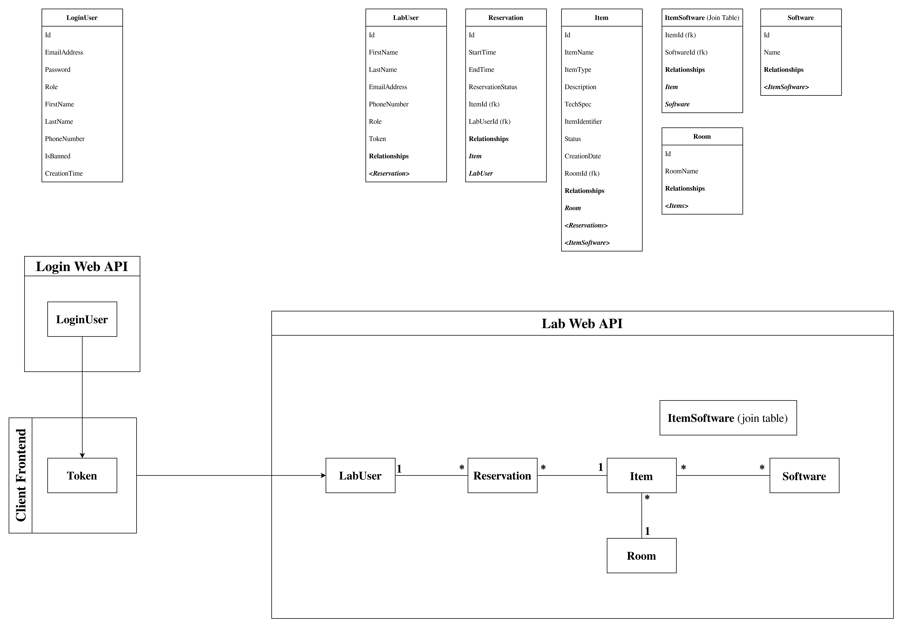

# Table of Contents

- [Lecture info](#orgd221369)

1.  [Project 8.1](#orgf0fac26)
    1.  [UML](#orgd862284)

# Lecture info

- Date: [2023-11-07 Tue]

# Project 8.1

Per questo progetto ho decisio di trattare le due applicazioni come due microservizi indipendenti, con dei database **SQLite** dedicati.
Quindi avremo due Web API:

- **Login Web API**, è quell&rsquo;API che si occupa di gestire i **sign up** e **login** degli utenti, avrá un **admin** che gestisce la lista degli utenti registrati.
- **Lab Manager Web API**. è l&rsquo;API che si occupa di gestire il laboratorio, anche qui avremo un admin che gestisce le risorse dell&rsquo;API.

Le due API dovranno comunicare tra di loro, il **Login Web API** deve registrare l&rsquo;user dentro **Lab Manager Web API** se l&rsquo;user non è gia nel db del laboratorio, il **Login** deve autenticare l&rsquo;accesso al **Lab** e di conseguenza sbloccare le operazioni degli user loggati.
Entrambi le **API** sono state pensate come **Model First**, in ottica di integrazione con i database.
Qundi per ogni API ho definito i **Model** con le loro relazioni, cosí poi l&rsquo;**Entity Framework** si occupa di generare il db, con tutte le relazioni tra le tabelle.
Sto utilizzando il **Repository pattern** per nascondere il codice che si occupa di accedere ai dati del db, in questo modo se in futuro voglio cambiare il meccanismo di persistenza dei dati, per esempio utilizzando un file manager, posso farlo senza troppi problemi.

## UML

Ecco l&rsquo;**UML** del progetto:

